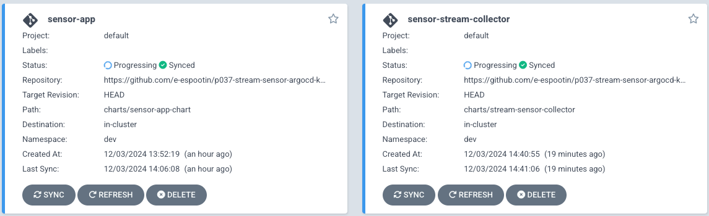
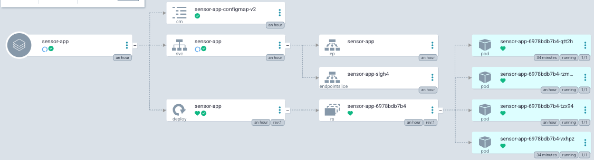
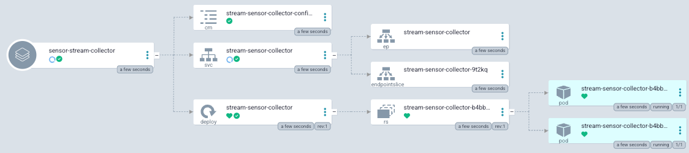

## project
p037-stream-sensor-argocd-kubernetes-datalake
project with:
- ArgoCD
- Kubernetes
- Kafka
- Weather info from OpenWeatherMap
- export messages to a datalake

### ArgoCD

### stream producer's containers

### stream consumer's containers

